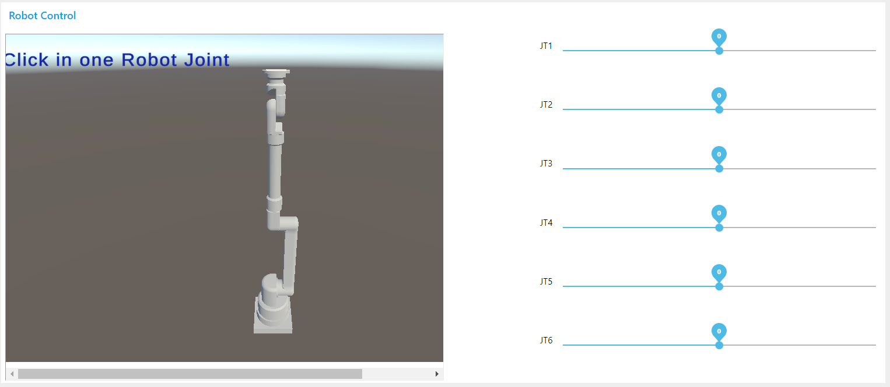
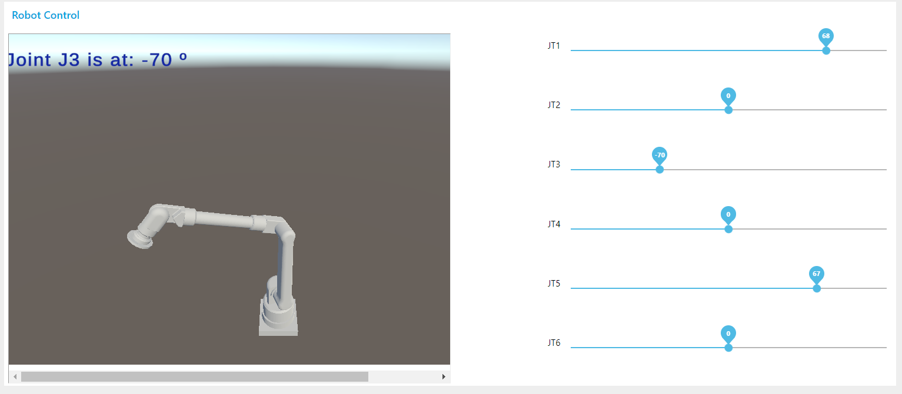

# The_IoT_VirtualRobot

This is a simple example of the vitualization of a 6 axis robot arm, getting data from an ASP .NET api and a very basic Node-Red UI to control the axis positions.

The Unity enviroment suports keyboard navigation using:
  * "a" and "d" to rotate the view horizontaly.
  * "s" and "w" to zoom (in/out) the view.
  * "q" and "e" to slide the view horizontaly.
  * "r" and "f" to move the view verticaly.
  * Click in the Joints to check the value by text.

## repository content:

- nodered-flow.json: the node-red flow to send data to the API
  * requires install of "node-red-dashboard" package

- IoTbotAPI: the .NET based API for HTTP get and post of axis position data

- CAD_theDtechVirtualRobot.zip: CAD files of the robot (made in FreeCad software)

- dockerFiles
  * WGLBuild
  * nodered-control
  * docker-compose.yml - use "docker-compose -f Virtual_Bot up" to run the container demo.
